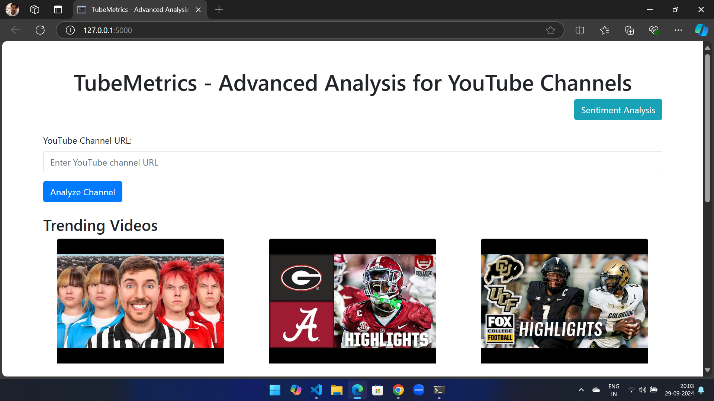

# YouTube Channel Details Viewer

This Flask application allows users to input a YouTube channel URL and retrieve detailed information about the channel, including the title, profile picture, description, total videos, average views, and more. It also displays trending videos on YouTube.

## Features

- Extracts channel information from various YouTube URL formats (channel ID, username, custom URL).
- Displays channel statistics such as total videos, average views, total long and short videos.
- Shows trending videos from YouTube.
- User-friendly interface built with HTML and Bootstrap.

## Technologies Used

- **Python**: Backend development using Flask.
- **Flask**: Web framework for building the application.
- **Google YouTube Data API v3**: To fetch channel and video details.
- **HTML/CSS**: For the frontend interface, styled with Bootstrap for responsiveness.

## Getting Started

### Prerequisites

- Python 3.x
- Flask
- Google API Client Library for Python
- A valid YouTube Data API key.

### Installation

1. Clone the repository:

   ```bash
   git clone https://github.com/machphy/youtube-channel-details-viewer.git
   cd youtube-channel-details-viewer
   ```

2. Install the required packages:

   ```bash
   pip install Flask google-api-python-client
   ```

3. Set your YouTube Data API key in the `app.py` file:

   ```python
   API_KEY = 'YOUR_YOUTUBE_API_KEY'
   ```

4. Run the Flask application:

   ```bash
   python app.py
   ```

5. Open your web browser and go to `http://127.0.0.1:5000/`.

## Usage

1. Enter a valid YouTube channel URL in the input field.
2. Click the "Submit" button to view the channel details.
3. The application will display:
   - Channel title
   - Profile picture
   - Description
   - Total videos
   - Average views
   - Number of long and short videos
   - Trending videos from YouTube

## Examples

### Valid Channel URLs

- Channel ID: `https://www.youtube.com/channel/CHANNEL_ID`
- Username: `https://www.youtube.com/user/USERNAME`
- Custom URL: `https://www.youtube.com/@USERNAME`

### Error Handling

The application will show error messages for invalid URLs or if the channel is not found.

## Screenshots

Here are some screenshots showing the application's interface and features:

1. **Channel Details Display:**
   
   
2. **Trending Videos:**
   

3. **Channel Stats Overview:**
   

4. **Channel Profile Display:**
   

5. **Video Count Statistics:**
   

6. **Average Views Display:**
   

7. **Error Handling Example (Invalid URL):**
   

8. **Custom URL Example:**
   

9. **User-Friendly Input Interface:**
   

10. **Mobile Responsive View:**
    

11. **Final Output View:**
    

## Contributing

Feel free to fork this repository and submit pull requests. Any contributions are welcome!

## License

This project is licensed under the MIT License - see the [LICENSE](LICENSE) file for details.

## Acknowledgments

- [YouTube Data API v3 Documentation](https://developers.google.com/youtube/v3)
- [Flask Documentation](https://flask.palletsprojects.com/)
```

### Instructions for Adding Screenshots:
1. Replace `path/to/your/screenshotX.png` with the actual path or file name for each screenshot you have saved.
2. Ensure all images are in the correct location within your project (e.g., a `screenshots/` folder).
3. You can reference your images either by their relative paths (e.g., `screenshots/screenshot1.png`) or their URLs if they are hosted online.

Let me know if you'd like further customization or help with any other sections!
